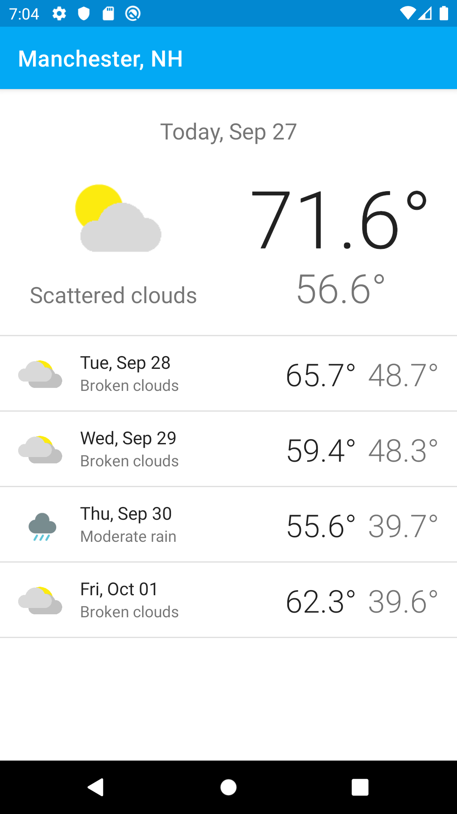
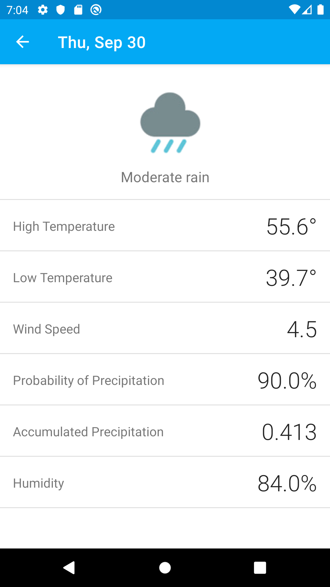
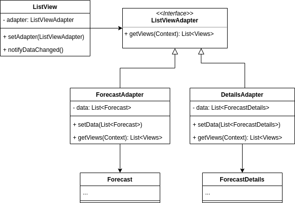

# Weather Forecast
COMP 730/830 Lab 5

 

Powered by [Weatherbit.io API](https://www.weatherbit.io/api)

## Objectives
- Learn how to use and implement Adapter Design Pattern.
- Introduce the Open-Closed Principle.
- Introduce the use of REST API.

## Instructions
### Part 1 - Weather API
1. Review [16 Day Weather Forecast API](https://www.weatherbit.io/api/weather-forecast-16-day) documentation
that is used to provide forecast data in this app. 
2. Open `WeatherAPI` java class and answer the questions:
   * How is the endpoint URL built?
   * When is the network request is executed?
   * What data structure does your request return?
   * How do we convert this data structure to `Forecast` objects?
3. To be able to use Weather API you will need the API key. You can generate your own by creating an account
at [weatherbit.io](https://www.weatherbit.io/) (free) or use the API key distributed in class.
4. Once you get the key, update this line in `WeatherAPI`
```java
private static final String API_KEY = "YOUR_API_KEY";
```

### Part 2 - ListViewAdapter
1. Review how `Forecast` and `ForecastDetail` objects are displayed on the screen.
2. Compare `ForecastListView` and `DetailsListView` classes and answer the questions.
   * What do they do similarly and what do they do different?  
   * What would you do if you were asked to create a screen with a list of settings options?
   * Can we display items different from `Forecast` in a `ForecastListView`?
   * How is `ForecastListView` dependent on changes in the `Forecast` class?
   * How do `ForecastListView` and `DetailsListView` violate the open-closed principle? 
3. Use Adapter design pattern to make generic `ListView` component. It uses its adapter to request
views from the adapted items. Then implement `ForecastAdapter` and `DetailsAdapter`
   that contain the code of how `Forecast` and `DetailsAdapter` objects are translated into displayable components.
   That way if the the business rules change the `ListView` will stay untouched and independent from those changes.
See the diagram below for more details.

   

4. Follow these steps to migrate to the `ListView` class:
   1. Update the corresponding view in the `activity_main.xml` file.
   2. Update `MainActivity`. Now we use `ListView` instead of `ForecastListView`. 
   3. Initialize `ForecastAdapter` and set it up in the list view.
   4. When you receive the data, pass it into the adapter.
   5. Then don't forget to notify the ListView that the data has changed. 
   6. Repead the steps 1-5 in the `DetailsActivity`
